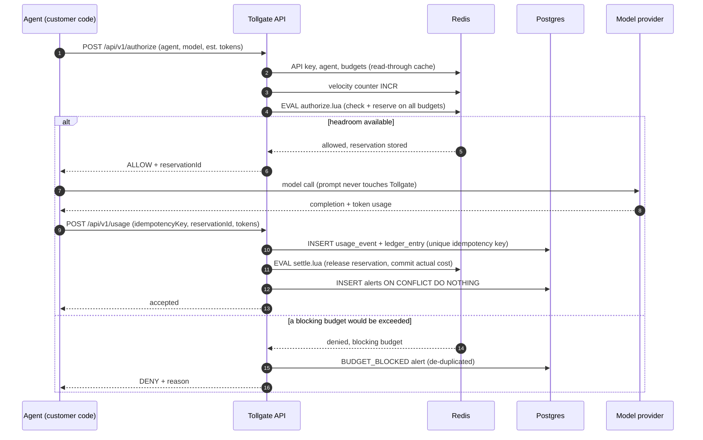
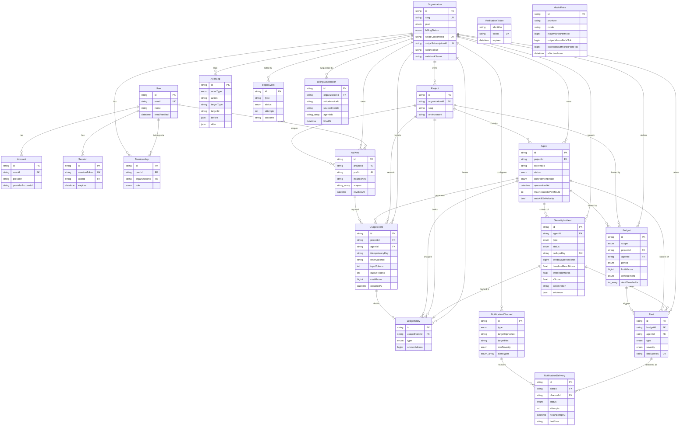

# Phase 2: System architecture

## Stack

| Layer | Choice | Why |
|---|---|---|
| Web + API | Next.js 15 App Router, TypeScript (strict) | One deployable for dashboard and API, route handlers on the Node runtime |
| Styling | Tailwind CSS 3 | Design tokens in config, no runtime CSS |
| Validation | Zod | Runtime validation that also produces the TypeScript types |
| Database | PostgreSQL 16 via Prisma 6 | Source of truth: ledger, usage, budgets, audit |
| Hot path | Redis 7 (Lua scripts) | Atomic multi-budget check-and-reserve in one round trip |
| Charts | Recharts | Declarative, responsive |
| Runtime | Docker (Node 22 Alpine), standalone Next output | Small, non-root image |
| CI | GitHub Actions | Typecheck, unit tests, build, end-to-end smoke test, image publish |

Money is stored as **BigInt micro-USD** everywhere (1 USD = 1,000,000 micros).
Costs round up to the next micro so spend is never under-reported.

## Processes

| Process | Image target | Scales | Responsibilities |
|---|---|---|---|
| Web + API | `runner` | Horizontally, stateless | Gateway (`/authorize`, `/usage`), management API, dashboard |
| Worker | `worker` | Horizontally | Notification engine (all replicas share the queue); anomaly engine (single elected leader) |

See [NOTIFICATIONS.md](NOTIFICATIONS.md) and [ANOMALY_DETECTION.md](ANOMALY_DETECTION.md).

## Request lifecycle

## Consistency model

* **Postgres** holds every usage event and ledger entry. A unique index on
  `(projectId, idempotencyKey)` makes ingestion exactly-once.
* **Redis** holds, per budget and period, a committed counter and a sorted set
  of in-flight reservations scored by expiry. Expired reservations are swept
  inside the authorize script, so a crashed agent can never hold headroom
  forever.
* **Recovery.** If a committed counter is missing it is rebuilt from Postgres
  with `SET NX`. If settlement fails after the database insert, the affected
  counters are deleted so the next request rebuilds them.
  `POST /api/v1/budgets/:id/reconcile` forces a rebuild on demand.
* **Topology.** Multi-key scripts need all keys on one primary: run Redis
  standalone or with Sentinel, with `maxmemory-policy noeviction`.

## Entity relationship diagram

`ModelPrice` and `VerificationToken` have no foreign keys: prices are looked
up by `(provider, model)` with the newest `effectiveFrom` that is not in the
future, so price changes never rewrite historical costs.

## Redis key layout

| Key | Type | Purpose |
|---|---|---|
| `tg:b:<budgetId>:<period>:c` | string | Committed micros for the period |
| `tg:b:<budgetId>:<period>:r` | zset | In-flight reservations, member `<resId>:<micros>`, score = expiry |
| `tg:res:<resId>` | string (JSON) | Reservation record used at settlement |
| `tg:vel:<agentId>:<minute>` | string | Velocity counter |
| `tg:rl:<apiKeyId>:<minute>` | string | API rate limit counter |
| `tg:cache:*` | string (JSON) | Read-through caches for keys, agents, budgets |
| `tg:stream:alerts` | stream | New alerts for the notification consumer group |
| `tg:notify:due` / `:inflight` | zset | Delayed delivery queue and leases |
| `tg:notify:dead` | list | Dead-letter log (last 10,000) |
| `tg:cb:<channelId>` | hash | Circuit breaker state |
| `tg:am:<agentId>:<hour>` | hash | Per-minute spend, requests, tokens for anomaly detection |
| `tg:ap:<agentId>` | hash | Long-term EWMA anomaly profile |
| `tg:lock:anomaly-engine` | string | Leader lease |

Period keys: `d:2026-10-03`, `w:2026-09-28` (ISO week starting Monday),
`m:2026-10`, or `all` for lifetime budgets. All windows are UTC.
