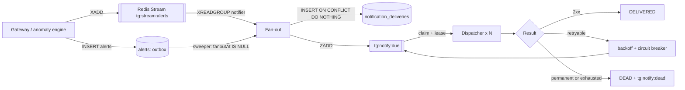

# Layer 1: Notification engine

Asynchronous delivery of alerts to Slack, Microsoft Teams, email and signed
webhooks, built to survive provider outages without losing an alert.

## Flow



## Guarantees

| Failure | What happens |
|---|---|
| Stream publish fails after the alert is committed | The outbox sweeper finds `fanoutAt IS NULL` within ~25 s and fans out |
| Worker crashes after reading the stream | `XAUTOCLAIM` hands the message to another consumer after 60 s |
| Worker crashes mid-send | The lease in `tg:notify:inflight` expires and the reaper re-queues it |
| Redis loses queue data | The reconciler re-enqueues overdue `PENDING`/`RETRY_SCHEDULED`/stuck `SENDING` rows from Postgres every 60 s |
| Two workers claim the same delivery | The `attempts` compare-and-set in Postgres lets exactly one proceed |
| Provider outage | Exponential backoff with jitter; after 5 consecutive failures the per-channel circuit opens and parks deliveries without spending attempts |

Delivery is **at-least-once** per (alert, channel). Emails sent through Resend
and generic webhooks carry the delivery id as an idempotency key; Slack and
Teams have no idempotency mechanism, so a crash between the provider accepting
a message and Postgres recording it can produce a duplicate post.

## Retry policy

Delay after the n-th failure: `min(max, base × 2^(n−1))`, equal jitter
(half fixed, half random). With the defaults (`base` 2 s, `max` 30 min,
10 attempts):

| Attempt | Waits between |
|---|---|
| 2 | 1–2 s |
| 3 | 2–4 s |
| 4 | 4–8 s |
| 5 | 8–16 s |
| 6 | 16–32 s |
| 7 | 32–64 s |
| 8 | 64–128 s |
| 9 | 128–256 s |
| 10 | 256–512 s |

`Retry-After` (seconds or HTTP date) is honoured when longer. Classification:
2xx success; 408, 409, 425, 429, 5xx, timeouts, DNS and connection errors are
retried; redirects and other 4xx are permanent; SMTP 4xx retried, 5xx permanent.

## Security

* Destinations are **encrypted at rest** (AES-256-GCM, `NOTIFICATION_ENCRYPTION_KEY`)
  with the organization id as associated data, so ciphertext copied between
  tenants fails to decrypt. API responses only show a masked hint.
* **SSRF protection:** Slack and Teams URLs must be on the providers' hosts;
  all destinations must be https, without credentials, and must not resolve to
  private, loopback, link-local or metadata addresses (checked again at send
  time against DNS rebinding). Redirects are never followed.
* Generic webhooks are signed: `x-tollgate-signature: sha256=HMAC(secret, "<timestamp>.<body>")`.

## Channel API (org:admin)

```bash
curl -s localhost:3000/api/v1/notification-channels -H "Authorization: Bearer $KEY" \
  -H "Content-Type: application/json" \
  -d '{"type":"SLACK","name":"#ai-spend","webhookUrl":"https://hooks.slack.com/services/T000/B000/XXXX","minSeverity":"WARNING"}'

curl -s -X POST localhost:3000/api/v1/notification-channels/<id>/test -H "Authorization: Bearer $KEY"
```

`EMAIL` takes `recipients: string[]`; `WEBHOOK` takes `webhookUrl` and an
optional `signingSecret`. `alertTypes` restricts a channel to specific alert
types (empty means all).

## Operations

Worker metrics at `:9100/metrics` (Prometheus): deliveries by channel and
outcome, delivery latency, queue depth (due, inflight, dead letter), circuit
openings and fan-outs by source. Alert on `tollgate_notification_queue_depth{state="dead_letter"}` increasing.
